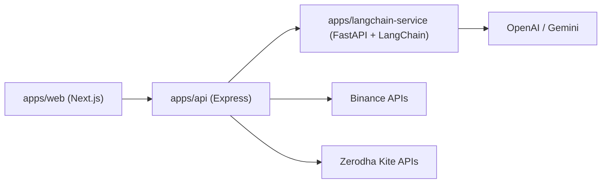

# AssetLens

AssetLens is a multi-service portfolio platform for tracking Binance and Zerodha assets, including mutual fund holdings and SIPs, with an AI-powered chat assistant for portfolio summaries and Q&A.

## Features

- Unified dashboard across Binance and Zerodha portfolios.
- Zerodha profile, equity holdings, mutual fund holdings, and SIP visibility.
- Portfolio allocation visualizations (exchange + asset level).
- FastAPI + LangChain AI service with ChatGPT and Gemini model selection.
- Floating chat widget with automatic portfolio summary on open, rendering rich **Markdown**, with a seamless full-screen mode.
- Butter-smooth UI transitions and element enter animations powered by **GSAP**.

## Architecture



## Monorepo Structure

```text
apps/
  api/                # Express API for portfolio + broker integrations
  web/                # Next.js frontend dashboard
  langchain-service/  # FastAPI service for LLM summarization/chat
```

See app-specific docs in [`apps/README.md`](apps/README.md).

## Tech Stack

- **Frontend:** Next.js 16, React 19, Tailwind CSS, Recharts, GSAP, React Markdown, Axios
- **API:** Node.js, Express, TypeScript, Axios
- **AI Service:** Python, FastAPI, LangChain, LangChain OpenAI, LangChain Google GenAI
- **Integrations:** Binance Wallet API, Zerodha Kite Connect

## Quick Start

### Prerequisites

- Node.js 20+ and npm
- Python 3.11+
- `uv` (Python package manager)

### 1) Start LangChain service

```bash
cd apps/langchain-service
uv sync
uv run --env-file .env uvicorn main:app --host 127.0.0.1 --port 8000 --reload
```

### 2) Start API service

```bash
cd apps/api
npm install
npm run dev
```

### 3) Start web app

```bash
cd apps/web
npm install
npm run dev
```

Open `http://localhost:3000`.

## Environment Variables

Use these templates:

- [`apps/api/.env.example`](apps/api/.env.example)
- [`apps/web/.env.example`](apps/web/.env.example)
- [`apps/langchain-service/.env.example`](apps/langchain-service/.env.example)

### Required keys by service

- **apps/api**
  - Binance + Zerodha keys
  - `PORT` (default `4000`)
  - `FASTAPI_BASE_URL` (default `http://localhost:8000`)
- **apps/web**
  - `NEXT_PUBLIC_API_URL` (default `http://localhost:4000`)
- **apps/langchain-service**
  - `OPENAI_API_KEY` and/or `GEMINI_API_KEY`

## API Overview
Please refer to 'Requestly.json' at the root of this project for API endpoint information.

### Portfolio

- `GET /portfolio/summary`
- `GET /portfolio/assets`
- `GET /portfolio/binance/inr-value`

### Binance

- `GET /binance/funding-account-data`
- `GET /binance/spot-account-data`

### Zerodha

- `GET /zerodha/profile`
- `GET /zerodha/stock-holdings-data`
- `GET /zerodha/mf-holdings-data`
- `GET /zerodha/mf-sips`
- `POST /zerodha/generate-token`

### AI (Node proxy)

- `POST /ai/portfolio-summary`
- `POST /ai/chat`

## AI Chat Flow

- Frontend chat widget calls Node `/ai/*` routes.
- Node API collects portfolio snapshot and forwards to FastAPI.
- FastAPI invokes LangChain with selected model:
  - `chatgpt` via `langchain-openai`
  - `gemini` via `langchain-google-genai`

## Quality Checks

Run these before merging:

```bash
# API
cd apps/api && npm run typecheck

# Web
cd apps/web && npx tsc --noEmit
```

## Troubleshooting

- **Chat returns 500 from API:** verify `FASTAPI_BASE_URL` and FastAPI process is running.
- **Gemini not working:** set `GEMINI_API_KEY` (or `GOOGLE_API_KEY`) in `apps/langchain-service/.env`.
- **OpenAI not working:** set `OPENAI_API_KEY` in `apps/langchain-service/.env`.
- **Frontend cannot reach API:** ensure `NEXT_PUBLIC_API_URL` points to API host/port.

## Contributing

Contributions are welcome. Keep changes scoped, update docs for behavior/env changes, and run type checks before opening a PR.

## Future Plans

- Move MF valuation fully into backend portfolio aggregation to remove client-side merges.
- Add historical portfolio snapshots and time-series P&L analytics.
- Add alerts for SIP events and allocation drift thresholds.
- Improve AI context management with snapshot caching and conversation memory controls.
- Add user authentication and multi-account support.
- Improve deployment reliability with Docker Compose and CI/CD workflows.
- Expand automated test coverage for API integration and UI flows.