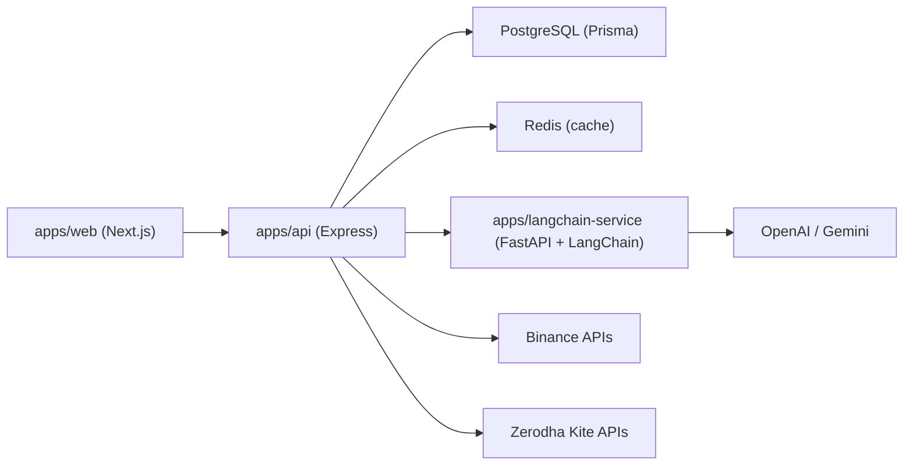

# AssetLens

AssetLens is a multi-service portfolio platform for tracking Binance and Zerodha assets, including mutual fund holdings and SIPs, with an AI-powered chat assistant for portfolio summaries and Q&A.

## Features

- **Accounts:** Sign up, log in, JWT sessions, and a Settings page to store Binance and Zerodha API credentials (encrypted at rest in PostgreSQL).
- Unified dashboard across Binance and Zerodha portfolios (data scoped per logged-in user).
- Zerodha profile, equity holdings, mutual fund holdings, SIP visibility, Kite login redirect, and daily session token storage.
- Portfolio allocation visualizations (exchange + asset level), including Binance INR aggregation.
- FastAPI + LangChain AI service with ChatGPT and Gemini model selection.
- Floating chat widget with automatic portfolio summary on open, rendering rich **Markdown**, with a seamless full-screen mode.
- Butter-smooth UI transitions and element enter animations powered by **GSAP**.

## Architecture



## Monorepo Structure

```text
apps/
  api/                # Express API: auth, portfolio, broker integrations, AI proxy
  web/                # Next.js frontend dashboard + auth pages
  langchain-service/  # FastAPI service for LLM summarization/chat
```

See app-specific docs in [`apps/README.md`](apps/README.md).

## Tech Stack

- **Frontend:** Next.js 16, React 19, Tailwind CSS, Recharts, GSAP, React Markdown, Axios
- **API:** Node.js, Express, TypeScript, Prisma 7 (PostgreSQL), Redis (ioredis), JWT, AES-256-GCM for secrets
- **AI Service:** Python, FastAPI, LangChain, LangChain OpenAI, LangChain Google GenAI
- **Integrations:** Binance Wallet / Spot APIs, Zerodha Kite Connect

## Quick Start

### Prerequisites

- Node.js 20+ and npm
- Python 3.11+
- `uv` (Python package manager)
- **PostgreSQL** and **Redis** (local or Docker) for `apps/api`

### 1) Start LangChain service

```bash
cd apps/langchain-service
uv sync
uv run --env-file .env uvicorn main:app --host 127.0.0.1 --port 8000 --reload
```

### 2) Start API service

```bash
cd apps/api
npm install
cp .env.example .env   # then edit DATABASE_URL, REDIS_URL, JWT_SECRET, ENCRYPTION_KEY
npx prisma migrate dev  # first-time DB setup
npm run dev
```

### 3) Start web app

```bash
cd apps/web
npm install
npm run dev
```

Open `http://localhost:3000`. Create an account, add broker keys in **Settings**, complete Zerodha Kite login when prompted (`/trade/redirect`).

## Environment Variables

Use these templates:

- [`apps/api/.env.example`](apps/api/.env.example)
- [`apps/web/.env.example`](apps/web/.env.example)
- [`apps/langchain-service/.env.example`](apps/langchain-service/.env.example)

### Required keys by service

- **apps/api**
  - `DATABASE_URL`, `REDIS_URL`, `JWT_SECRET`, `ENCRYPTION_KEY`
  - `PORT` (default `4000`)
  - `FASTAPI_BASE_URL` (default `http://localhost:8000`)
  - Optional: `ZERODHA_ACCESS_TOKEN` fallback before DB-stored daily token
  - Binance and Zerodha **API keys are stored per user in the database** (not required in `.env` for normal operation)
- **apps/web**
  - `NEXT_PUBLIC_API_URL` (default `http://localhost:4000`)
- **apps/langchain-service**
  - `OPENAI_API_KEY` and/or `GEMINI_API_KEY`

## Authentication

- **Public:** `POST /auth/register`, `POST /auth/login`, `GET /health`
- **Protected (Bearer JWT):** all other API routes, including `/binance/*`, `/zerodha/*`, `/portfolio/*`, `/ai/*`
- The web app stores the JWT in `localStorage` and sends `Authorization: Bearer <token>` on API requests.

## API Overview

See [`Requestly.json`](Requestly.json) at the repo root for detailed request examples. Summary below.

### Auth

- `POST /auth/register` — create user (username + password)
- `POST /auth/login` — returns JWT
- `GET /auth/me` — profile + flags for saved credentials
- `PUT /auth/credentials` — upsert encrypted Binance and/or Zerodha API keys

### Portfolio (JWT required)

- `GET /portfolio/summary`
- `GET /portfolio/assets`
- `GET /portfolio/binance/inr-value`

### Binance (JWT required)

- `GET /binance/funding-account-data`
- `GET /binance/spot-account-data`
- `GET /binance/permissions`
- `POST /binance/convert`
- `POST /binance/transfer`

### Zerodha (JWT required)

- `GET /zerodha/login-url` — Kite login URL from stored API key
- `GET /zerodha/profile`
- `GET /zerodha/stock-holdings-data`
- `GET /zerodha/mf-holdings-data`
- `GET /zerodha/mf-sips`
- `POST /zerodha/generate-token` — exchange `request_token` (body), persist access token
- `POST /zerodha/place-order` — place equity order (validated body)

### AI (Node proxy, JWT required)

- `POST /ai/portfolio-summary`
- `POST /ai/chat`

## AI Chat Flow

- Frontend chat widget calls Node `/ai/*` routes with the user JWT.
- Node API builds a portfolio snapshot for **that user** and forwards to FastAPI.
- FastAPI invokes LangChain with the selected model (`chatgpt` / `gemini`).

## Quality Checks

Run these before merging:

```bash
# API
cd apps/api && npm run typecheck

# Web
cd apps/web && npx tsc --noEmit
```

## Troubleshooting

- **Chat returns 500 from API:** verify `FASTAPI_BASE_URL` and FastAPI process is running.
- **Gemini not working:** set `GEMINI_API_KEY` (or `GOOGLE_API_KEY`) in `apps/langchain-service/.env`.
- **OpenAI not working:** set `OPENAI_API_KEY` in `apps/langchain-service/.env`.
- **Frontend cannot reach API:** ensure `NEXT_PUBLIC_API_URL` points to API host/port.
- **401 on broker routes:** log in on the web app; add keys in Settings; for Zerodha, complete Kite login so the daily access token exists.
- **Wrong user’s data:** ensure you are logged in as the intended account; broker and portfolio caches are keyed by `userId`.

## Contributing

Contributions are welcome. Keep changes scoped, update docs for behavior or env changes, and run type checks before opening a PR.

## Future Plans

- Move MF valuation fully into backend portfolio aggregation to remove client-side merges.
- Add historical portfolio snapshots and time-series P&L analytics.
- Add alerts for SIP events and allocation drift thresholds.
- Improve AI context management with snapshot caching and conversation memory controls.
- Improve deployment reliability with Docker Compose and CI/CD workflows.
- Expand automated test coverage for API integration and UI flows.
