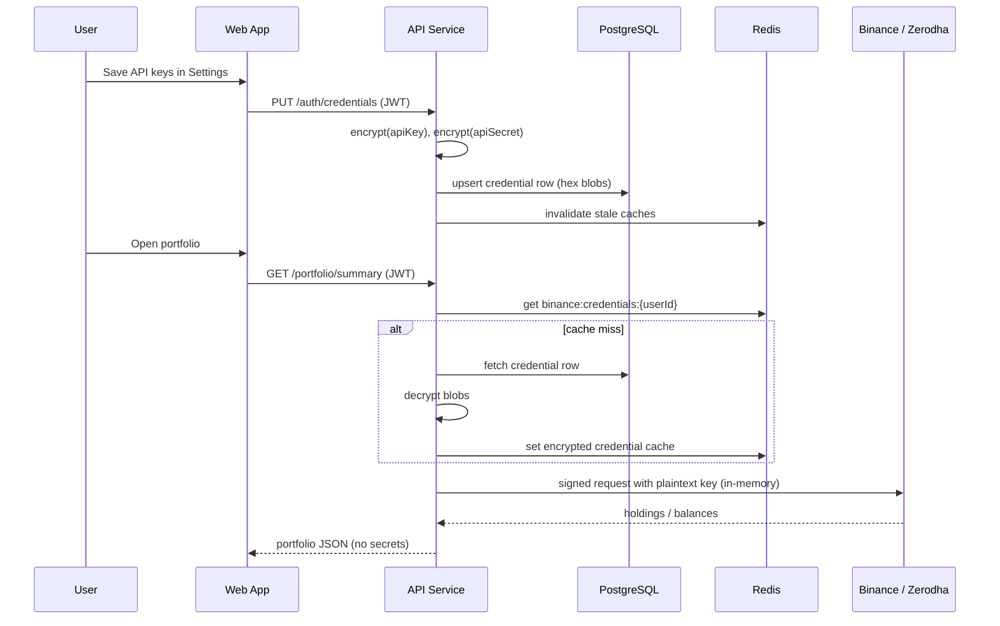

# 🔐 Encrypting Broker API Keys at Rest: A Design Walkthrough from AssetLens

> Passwords hash; API keys don't. Here's how I store broker credentials in Postgres without pretending the problem is solved.

While building [AssetLens](https://github.com/ManikLakhanpal/AssetLens) — a multi-broker portfolio tracker that pulls data from Binance and Zerodha into one dashboard — I ran into a problem that a lot of "connect your account" apps eventually face:

**How do you store a user's exchange API keys without turning your database into a liability?**

This post walks through the design behind AssetLens's credential storage layer, why I picked the approach I did, and what I'd change if I were rebuilding it today.

---

## 😬 The problem

AssetLens needs standing API keys for each user's Binance and Zerodha accounts so it can pull holdings, fund data, and place trades on request. That means the keys have to live somewhere persistent — not just in a session — and they have to be usable by the backend on demand, not just verifiable like a password.

That second constraint rules out the easy answer.

With a password, you hash it, compare hashes, and never touch the plaintext again. We use **bcrypt** for user login passwords in AssetLens — same idea.

With a broker API key, the server needs the *actual value* every time it calls Binance or Zerodha on the user's behalf. So the credential has to be **recoverable**, not just checkable — which pushes the problem from hashing into **reversible encryption**, a much easier category to get wrong.

---

## 🛠️ The approach

I settled on **AES-256-GCM** for credentials at rest in PostgreSQL, with the encryption key held only in the API service's environment (`ENCRYPTION_KEY`), never in the database itself.

A few reasons GCM specifically, over something simpler like AES-CBC:

- **Authenticated encryption.** GCM produces a tag alongside the ciphertext that lets the app detect tampering before decrypting. If a row gets corrupted or modified out of band, decryption fails loudly instead of silently returning garbage bytes that get passed to a broker API.
- **No separate MAC step.** With CBC you'd typically bolt on an HMAC to get integrity guarantees, which means more moving parts and more chances to implement it incorrectly. GCM gives you confidentiality and integrity in one primitive.
- **Per-record IVs.** Each encrypted value gets its own 12-byte initialization vector, generated at write time with `crypto.randomBytes()`. Reusing an IV under the same key is one of the more common ways GCM implementations get quietly broken, so this was a deliberate part of the write path rather than an afterthought.

### Storage format (not separate columns)

One thing that's easy to get wrong in diagrams: we don't store `iv`, `authTag`, and `ciphertext` as separate database columns. Each secret is a **single hex-encoded blob** concatenated in a fixed layout:

```
┌─────────────┬──────────────┬─────────────────┐
│  IV (12 B)  │ Tag (16 B)   │   Ciphertext    │
└─────────────┴──────────────┴─────────────────┘
                    ↓
            stored as hex TEXT
            (apiKey, apiSecret, accessToken)
```

In Prisma, the schema is intentionally boring — just `String` fields on per-user credential tables:

```prisma
model BinanceCredentials {
  userId    String @unique
  apiKey    String   // encrypted blob
  apiSecret String   // encrypted blob
}

model ZerodhaCredentials {
  userId      String  @unique
  apiKey      String  // encrypted blob
  apiSecret   String  // encrypted blob
  accessToken String? // encrypted blob (daily Kite token)
}
```

### The actual crypto helper (~50 lines)

The whole encryption layer lives in one small Node.js module. No wrapper library, just `crypto`:

```typescript
import { createCipheriv, createDecipheriv, randomBytes } from "crypto";

const ALGORITHM = "aes-256-gcm";
const IV_LENGTH = 12;
const TAG_LENGTH = 16;

function getEncryptionKey(): Buffer {
  const raw = process.env.ENCRYPTION_KEY;
  if (!raw) throw new Error("ENCRYPTION_KEY env var is not set");
  const key = Buffer.from(raw, "hex");
  if (key.length !== 32) {
    throw new Error("ENCRYPTION_KEY must be 32 bytes (64 hex chars)");
  }
  return key;
}

export function encrypt(plaintext: string): string {
  const key = getEncryptionKey();
  const iv = randomBytes(IV_LENGTH);
  const cipher = createCipheriv(ALGORITHM, key, iv);

  const encrypted = Buffer.concat([
    cipher.update(plaintext, "utf8"),
    cipher.final(),
  ]);
  const authTag = cipher.getAuthTag();

  return Buffer.concat([iv, authTag, encrypted]).toString("hex");
}

export function decrypt(ciphertext: string): string {
  const key = getEncryptionKey();
  const buf = Buffer.from(ciphertext, "hex");

  const iv = buf.subarray(0, IV_LENGTH);
  const authTag = buf.subarray(IV_LENGTH, IV_LENGTH + TAG_LENGTH);
  const encrypted = buf.subarray(IV_LENGTH + TAG_LENGTH);

  const decipher = createDecipheriv(ALGORITHM, key, iv);
  decipher.setAuthTag(authTag);

  return Buffer.concat([
    decipher.update(encrypted),
    decipher.final(),
  ]).toString("utf8");
}
```

Generate the key once at deploy time:

```bash
openssl rand -hex 32
```

⚠️ **Operational gotcha:** if you rotate `ENCRYPTION_KEY` without a re-encryption migration, every stored secret becomes undecryptable. There is no magic recovery path — plan for that before you ship.

### Write and read paths

Conceptually:

**Write** (Settings → `PUT /auth/credentials`, JWT required):

```
function storeCredential(userId, plaintextKey):
    blob = AES_256_GCM_encrypt(plaintextKey, ENCRYPTION_KEY)  // iv + tag + ciphertext → hex
    db.upsert(userId, { apiKey: blob })   // or apiSecret, accessToken, etc.
```

**Read** (only inside the request that actually calls Binance or Zerodha):

```
function getCredential(userId):
    record = db.fetch(userId)
    plaintextKey = AES_256_GCM_decrypt(record.apiKey, ENCRYPTION_KEY)
    return plaintextKey   // in-memory for this request only — never sent to the client
```

The decrypted value never leaves the API process boundary to the **client**. It's pulled into memory to sign a request to Binance or Zerodha, used, and discarded — it's not logged and not included in API responses.

### Zerodha adds a third secret 🔑

Binance is static API key + secret. Zerodha (Kite) has those too, but also a **daily OAuth access token** that expires and must be refreshed.

Flow:

1. User saves API key + secret via Settings.
2. User completes Kite login → `POST /zerodha/generate-token` with a `request_token`.
3. Backend exchanges it for an access token, **encrypts it**, and stores it in `ZerodhaCredentials.accessToken`.
4. On portfolio requests, `createKiteClient(userId)` decrypts the token and builds a scoped Kite client.

Same AES helper, same blob format — just one more field in the credential row.

---

## 🗄️ Redis: encrypted credentials, plaintext portfolio data

Credentials are also cached in Redis to avoid decrypting from Postgres on every portfolio refresh. Important nuance: **credential caches are re-encrypted** before they hit Redis.

| Redis key | Encrypted? | TTL | What's inside |
|-----------|------------|-----|---------------|
| `binance:credentials:{userId}` | ✅ Yes | 1 hour | `{ apiKey, apiSecret }` as encrypted JSON |
| `zerodha:creds:{userId}` | ✅ Yes | 24 hours | `{ apiKey, accessToken }` as encrypted JSON |
| `portfolio:summary:{userId}` | ❌ No | 60s | Plain JSON totals |
| `binance:inr:{userId}` | ❌ No | 60s | Plain JSON holdings |

So a Redis snapshot is still sensitive (portfolio numbers are plaintext), but broker keys in cache remain encrypted under the same app key. That's a deliberate performance trade-off, not an accident.

When Binance credentials are updated, we invalidate the relevant cache keys. Zerodha credential updates should do the same — more on that in the "what I'd change" section.

---

## 🤔 Why not just use a secrets manager?

This is the honest trade-off: a managed secrets service (AWS Secrets Manager, Vault, etc.) would be the "correct" answer for key management at scale, since it handles rotation, access auditing, and takes the encryption key out of application config entirely.

For a project running as a small self-hosted stack — Postgres, Redis, and a handful of services in Docker Compose — pulling in a secrets manager was more infrastructure than the problem justified at that stage. AES-256-GCM with an env-scoped key gets most of the security benefit (per-user credentials aren't stored in the clear, tampering is detectable) without adding an external dependency the deployment story didn't need yet.

That said, it's a real limitation worth naming rather than hiding:

- The encryption key itself is a **single point of failure**.
- There's **no built-in key rotation**.
- If AssetLens grew past a single-operator project, migrating that key into a managed secrets store — with rotation and access logging — would be the first infrastructure change I'd make.

---

## 🧱 Isolation beyond encryption

Encryption at rest solves one problem, but it doesn't solve cross-user data leakage on its own. AssetLens layers two more things on top:

1. **JWT-scoped requests.** Every protected route requires a bearer token. The `userId` from that token — not anything from the request body — determines whose credentials get decrypted and whose portfolio data gets returned.
2. **Cache keys scoped by user ID.** Portfolio and broker data cached in Redis is keyed per user, so a cache hit for one account can't leak into another account's dashboard under concurrent requests.

None of these are exotic techniques individually, but the combination — encrypted storage, request-scoped decryption, and per-user cache isolation — is what makes it reasonable to let a backend service hold live trading credentials for multiple people at once.

### What this protects (and what it doesn't) 🎯

| Threat | Mitigated? |
|--------|------------|
| Postgres dump / backup leak | ✅ Ciphertext only |
| Tampered DB row | ✅ GCM auth tag fails decrypt |
| Cross-user data access via API | ✅ JWT + `userId`-scoped queries |
| Compromised `ENCRYPTION_KEY` | ❌ Game over for all stored secrets |
| Compromised API server at runtime | ❌ Plaintext exists in memory during broker calls |
| XSS stealing JWT from localStorage | ❌ Attacker can act as the user |
| Redis snapshot | ⚠️ Portfolio data exposed; credential keys still encrypted |

Being explicit about the threat model is part of the design doc, not a footnote.

---

## 🔄 End-to-end flow



---

## 🔧 What I'd do differently

Looking back, a few things stand out:

- **Key rotation was never built in.** The encryption key is static for the life of the deployment. A rotation scheme (even a simple "re-encrypt on next login" strategy) would close that gap without requiring a full secrets-manager migration.
- **No audit trail on decryption.** Right now there's no record of *when* a given credential was decrypted and used. For anything handling brokerage-level trading access, a lightweight audit log of decrypt events would be a cheap addition with real value if something ever needed investigating.
- **Zerodha cache invalidation is incomplete.** Updating Binance credentials clears `binance:credentials:{userId}` from Redis. Updating Zerodha credentials doesn't yet clear `zerodha:creds:{userId}` — stale session data can linger for up to 24 hours. I'd add symmetric invalidation on credential save.
- **Portfolio data in Redis is plaintext.** Fine for a personal project; for a stricter threat model I'd either encrypt those caches too or shorten TTLs aggressively.

Security work like this rarely feels finished — it's a series of trade-offs made against the actual constraints of the project at the time, with the honest ones documented so the next person (often future-me) knows exactly where the shortcuts are.

---

## ✅ If you're building something similar

Quick checklist:

- [ ] Use **AES-256-GCM** (or another AEAD) — not bare AES-CBC without a MAC
- [ ] Generate a proper 256-bit key: `openssl rand -hex 32`
- [ ] Fresh random IV per encryption — never reuse under the same key
- [ ] Store IV + tag + ciphertext in a format *you* own (separate columns optional)
- [ ] Scope every decrypt to `req.userId` from a verified JWT — never trust the request body for identity
- [ ] Never return decrypted secrets to the client
- [ ] Document what happens when the encryption key rotates (or doesn't)
- [ ] Be honest about Redis, logs, and in-memory exposure

---

## 📎 Links

- **Repo:** [github.com/ManikLakhanpal/AssetLens](https://github.com/ManikLakhanpal/AssetLens)
- **Crypto module:** `apps/api/src/services/auth/cryptoService.ts`
- **Credential save path:** `apps/api/src/services/auth/authService.ts`

---

*Security is a process, not a checkbox. This is where AssetLens stands today — not where I'd stop if it were handling other people's money at scale.*
